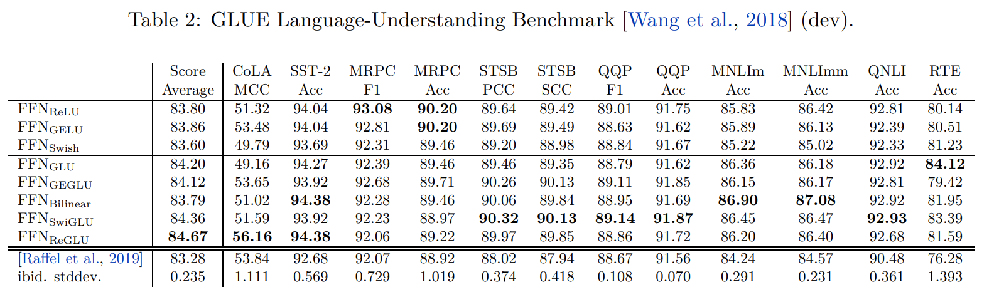

# GLU


[](https://github.com/Rishit-dagli/GLU/actions/workflows/linter.yml)
[](https://github.com/Rishit-dagli/GLU/actions/workflows/python-publish.yml)
[](https://github.com/psf/black)

[](https://github.com/Rishit-dagli/GLU/stargazers)
[](https://github.com/Rishit-dagli)
[](https://twitter.com/intent/follow?screen_name=rishit_dagli)

An easy-to-use library for GLU (Gated Linear Units) and GLU variants in TensorFlow. This repository allows you to easily make use of the following activation functions:

- **GLU** introduced in the paper Language Modeling with Gated Convolutional Networks [1]
- **Bilinear** introduced in the paper Language Modeling with Gated Convolutional Networks [1] atrributed to Mnih et al. [2]
- **ReGLU** introduced in the paper GLU Variants Improve Transformer [3]
- **GEGLU** introduced in the paper GLU Variants Improve Transformer [3]
- **SwiGLU** introduced in the paper GLU Variants Improve Transformer [3]
- **SeGLU**



Gated Linear Units consist of the component-wise product of two linear projections, one of which is first passed through a sigmoid function. Variations on GLU are possible, using different nonlinear (or even linear) functions in place of sigmoid. In the GLU Variants Improve Transformer [3] paper,  in a fine-tuning scenario the new variants seem to produce better perplexities for the de-noising objective used in pre-training, as well as better results on many downstream language-understanding tasks. Furthermore these do not have any apparent computational drawbacks.

## Installation

Run the following to install:

```sh
pip install glu-tf
```

## Developing glu-tf

To install `glu-tf`, along with tools you need to develop and test, run the following in your virtualenv:

```sh
git clone https://github.com/Rishit-dagli/GLU.git
# or clone your own fork

cd GLU
pip install -e .[dev]
```

## Usage

In this section, I show a minimal example of using the SwiGLU activation function but you can use the other activations in  similar manner:

```python
import tensorflow as tf
from glu_tf import SwiGLU

model = tf.keras.Sequential()
model.add(tf.keras.layers.Dense(units=10)
model.add(SwiGLU(bias = False, dim=-1, name='swiglu'))
```

## Want to Contribute 🙋‍♂️?

Awesome! If you want to contribute to this project, you're always welcome! See [Contributing Guidelines](CONTRIBUTING.md). You can also take a look at [open issues](https://github.com/Rishit-dagli/GLU/issues) for getting more information about current or upcoming tasks.

## Want to discuss? 💬

Have any questions, doubts or want to present your opinions, views? You're always welcome. You can [start discussions](https://github.com/Rishit-dagli/GLU/discussions).

## References

[1] Dauphin, Yann N., et al. ‘Language Modeling with Gated Convolutional Networks’. ArXiv:1612.08083 [Cs], Sept. 2017. arXiv.org, http://arxiv.org/abs/1612.08083.

[2] Mnih, A., and Hinton, G. 2007. Three new graphical models for statistical language modelling. In Proceedings of the 24th international conference on Machine learning (pp. 641–648).

[3] Shazeer, Noam. ‘GLU Variants Improve Transformer’. ArXiv:2002.05202 [Cs, Stat], Feb. 2020. arXiv.org, http://arxiv.org/abs/2002.05202.
